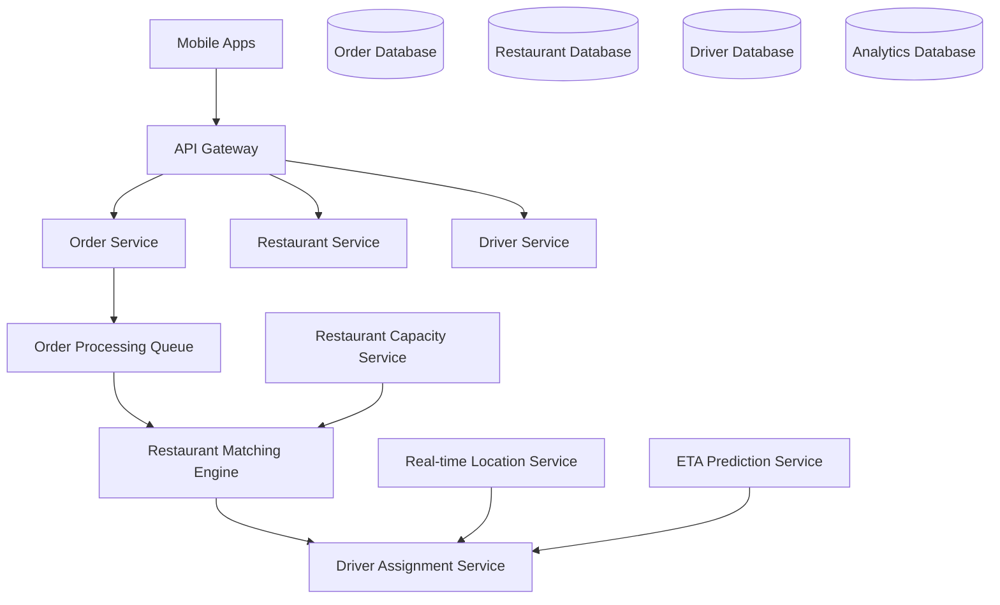

# Uber L4 Software Engineer - Scaling from Startup to Marketplace

## Background

After 3 years building products at a mid-size fintech startup, I was ready to tackle larger scale challenges. Uber's L4 (Software Engineer II) role offered the perfect opportunity to work on marketplace dynamics and real-time systems serving millions of users. This breakdown covers my successful transition from startup to big tech.

## Uber's L4 Interview Approach

For mid-level engineers, Uber focuses on:
- **Solid Fundamentals**: Strong coding and system design foundation
- **Growth Potential**: Ability to handle increasing complexity
- **Marketplace Understanding**: Grasping two-sided platform dynamics
- **Production Mindset**: Building reliable systems, not just features

**Key Difference from L5A**: Less emphasis on technical leadership, more focus on individual contribution and learning ability.

## Timeline & Process Overview

- **Application**: December 2025 (university alumni referral)
- **Recruiter Screen**: January 2026 (30 min)
- **Technical Phone Screen**: January 2026 (45 min)
- **Virtual Onsite**: February 2026 (4 rounds, 3.5 hours)
- **Final Decision**: Early March 2026

**Total Duration**: ~10 weeks with steady progression

## Round 1: Recruiter Screen (30 minutes)

Standard conversation covering:
- Experience with backend systems and APIs
- Interest in Uber's mission and products
- Career goals and growth trajectory
- Compensation expectations

**Focus**: Understanding motivation for joining Uber and readiness for larger scale challenges.

## Round 2: Technical Phone Screen (45 minutes)

### Problem: Design Uber's Surge Pricing Algorithm

Create a system component that calculates surge multipliers based on real-time supply and demand:

**Requirements**:
- Process location updates from 100K+ active drivers
- Calculate surge multipliers for geographic regions
- Update pricing in near real-time (< 30 seconds)
- Handle edge cases like events, weather, airport queues

**My Solution Approach**:

```python
from typing import Dict, List, Tuple
from dataclasses import dataclass
from enum import Enum
import time
import math

@dataclass
class Location:
    latitude: float
    longitude: float
    
@dataclass 
class Driver:
    driver_id: str
    location: Location
    status: str  # available, busy, offline
    last_update: int

@dataclass
class RideRequest:
    request_id: str
    pickup_location: Location
    timestamp: int
    estimated_duration: int

class SurgePricingEngine:
    def __init__(self):
        self.grid_size = 0.01  # ~1km grid cells
        self.supply_demand_cache = {}
        self.surge_multipliers = {}
        self.min_surge = 1.0
        self.max_surge = 3.0
        
    def update_driver_location(self, driver: Driver):
        """Update driver location and recalculate surge for affected grid"""
        grid_cell = self._get_grid_cell(driver.location)
        
        # Update supply count for this grid cell
        if grid_cell not in self.supply_demand_cache:
            self.supply_demand_cache[grid_cell] = {'supply': 0, 'demand': 0}
            
        # Recalculate supply in this grid cell
        self._recalculate_supply(grid_cell)
        
        # Update surge multiplier
        self._update_surge_multiplier(grid_cell)
    
    def add_ride_request(self, request: RideRequest):
        """Add ride request and update demand for grid cell"""
        grid_cell = self._get_grid_cell(request.pickup_location)
        
        if grid_cell not in self.supply_demand_cache:
            self.supply_demand_cache[grid_cell] = {'supply': 0, 'demand': 0}
            
        # Increment demand
        self.supply_demand_cache[grid_cell]['demand'] += 1
        
        # Update surge multiplier
        self._update_surge_multiplier(grid_cell)
    
    def get_surge_multiplier(self, location: Location) -> float:
        """Get current surge multiplier for location"""
        grid_cell = self._get_grid_cell(location)
        return self.surge_multipliers.get(grid_cell, 1.0)
    
    def _get_grid_cell(self, location: Location) -> Tuple[int, int]:
        """Convert lat/lng to grid cell coordinates"""
        lat_cell = int(location.latitude / self.grid_size)
        lng_cell = int(location.longitude / self.grid_size)
        return (lat_cell, lng_cell)
    
    def _recalculate_supply(self, grid_cell: Tuple[int, int]):
        """Recalculate available driver supply in grid cell"""
        # In production, this would query a spatial index
        # For interview, we'll simulate the calculation
        available_drivers = self._get_available_drivers_in_grid(grid_cell)
        self.supply_demand_cache[grid_cell]['supply'] = len(available_drivers)
    
    def _update_surge_multiplier(self, grid_cell: Tuple[int, int]):
        """Calculate surge multiplier based on supply/demand ratio"""
        data = self.supply_demand_cache.get(grid_cell, {'supply': 1, 'demand': 0})
        
        supply = max(1, data['supply'])  # Avoid division by zero
        demand = data['demand']
        
        if demand == 0:
            surge = self.min_surge
        else:
            # Surge increases exponentially as demand exceeds supply
            ratio = demand / supply
            if ratio <= 1.0:
                surge = self.min_surge
            else:
                surge = self.min_surge + (ratio - 1.0) * 0.5
                surge = min(surge, self.max_surge)
        
        self.surge_multipliers[grid_cell] = round(surge, 1)
    
    def _get_available_drivers_in_grid(self, grid_cell: Tuple[int, int]) -> List[Driver]:
        """Get available drivers in grid cell (simulated for interview)"""
        # In production: spatial query on driver locations
        return []  # Placeholder for interview

# Usage example
pricing_engine = SurgePricingEngine()

# Simulate driver updates
driver = Driver("driver_123", Location(37.7749, -122.4194), "available", int(time.time()))
pricing_engine.update_driver_location(driver)

# Simulate ride requests
request = RideRequest("req_456", Location(37.7749, -122.4194), int(time.time()), 1200)
pricing_engine.add_ride_request(request)

# Get surge multiplier
surge = pricing_engine.get_surge_multiplier(Location(37.7749, -122.4194))
print(f"Current surge multiplier: {surge}x")
```

**Key Discussion Points**:
- **Grid-based partitioning** for spatial calculations
- **Real-time updates** vs batch processing trade-offs  
- **Edge cases**: Airport queues, events, weather impacts
- **Scalability**: How to handle 100K+ concurrent drivers
- **Fairness**: Ensuring algorithm doesn't create pricing dead zones

**Interviewer Follow-ups**:
- "How would you handle drivers gaming the system by turning off the app?"
- "What if there's a large event causing demand spike in one area?"
- "How do you ensure surge updates don't cause pricing oscillation?"

## Virtual Onsite Loop (4 Rounds)

### Round 3: Data Structures & Algorithms (1 hour)

**Problem 1: Optimal Driver Route Planning (30 minutes)**

Given a driver's current location and multiple ride requests, find the optimal pickup order to minimize total travel time while respecting time constraints.

**Input**:
```python
driver_location = Location(37.7749, -122.4194)
ride_requests = [
    RideRequest("req1", Location(37.7849, -122.4094), max_wait=300),  # 5 min max wait
    RideRequest("req2", Location(37.7649, -122.4294), max_wait=600),  # 10 min max wait  
    RideRequest("req3", Location(37.7549, -122.4394), max_wait=450),  # 7.5 min max wait
]
```

**My Approach**: Dynamic Programming with Bitmask

```python
def find_optimal_route(driver_location: Location, requests: List[RideRequest]) -> List[str]:
    n = len(requests)
    if n == 0:
        return []
    
    # Precompute distances between all points
    distances = {}
    all_locations = [driver_location] + [req.pickup_location for req in requests]
    
    for i in range(len(all_locations)):
        for j in range(len(all_locations)):
            if i != j:
                distances[(i, j)] = calculate_distance(all_locations[i], all_locations[j])
    
    # DP state: (current_location, visited_mask, current_time)
    # Value: minimum total travel time
    memo = {}
    
    def dp(current_pos: int, visited_mask: int, current_time: int) -> Tuple[float, List[int]]:
        if visited_mask == (1 << n) - 1:  # All requests visited
            return 0, []
        
        state = (current_pos, visited_mask, current_time)
        if state in memo:
            return memo[state]
        
        min_time = float('inf')
        best_path = []
        
        # Try visiting each unvisited request
        for i in range(n):
            if visited_mask & (1 << i):  # Already visited
                continue
            
            travel_time = distances[(current_pos, i + 1)]  # +1 because driver is at index 0
            new_time = current_time + travel_time
            
            # Check if we can reach this request within its max wait time
            if new_time <= requests[i].max_wait:
                new_visited = visited_mask | (1 << i)
                future_time, future_path = dp(i + 1, new_visited, new_time)
                
                if travel_time + future_time < min_time:
                    min_time = travel_time + future_time
                    best_path = [i] + future_path
        
        memo[state] = (min_time, best_path)
        return min_time, best_path
    
    _, optimal_path = dp(0, 0, 0)
    return [requests[i].request_id for i in optimal_path]
```

**Problem 2: Real-time ETA Updates (30 minutes)**

Design a data structure to efficiently update and query ETAs for active trips as traffic conditions change.

**My Solution**: Segment-based ETA tracking with priority queue for updates

```python
import heapq
from typing import Dict, List

class ETAManager:
    def __init__(self):
        self.active_trips = {}  # trip_id -> TripData
        self.update_queue = []  # Priority queue for ETA updates
        self.traffic_segments = {}  # segment_id -> current_speed_factor
        
    def start_trip(self, trip_id: str, route_segments: List[str], base_etas: List[int]):
        """Start tracking a new trip"""
        trip_data = TripData(trip_id, route_segments, base_etas)
        self.active_trips[trip_id] = trip_data
        
        # Schedule initial ETA calculation
        heapq.heappush(self.update_queue, (0, trip_id, 'initial'))
    
    def update_traffic_segment(self, segment_id: str, speed_factor: float):
        """Update traffic conditions for a segment"""
        self.traffic_segments[segment_id] = speed_factor
        
        # Find all trips affected by this segment
        affected_trips = []
        for trip_id, trip_data in self.active_trips.items():
            if segment_id in trip_data.remaining_segments:
                affected_trips.append(trip_id)
        
        # Schedule ETA recalculation for affected trips
        for trip_id in affected_trips:
            heapq.heappush(self.update_queue, (time.time(), trip_id, 'traffic_update'))
    
    def get_current_eta(self, trip_id: str) -> int:
        """Get current ETA for a trip"""
        if trip_id not in self.active_trips:
            return -1
        
        trip_data = self.active_trips[trip_id]
        current_eta = 0
        
        for segment_id in trip_data.remaining_segments:
            base_time = trip_data.segment_base_times[segment_id]
            traffic_factor = self.traffic_segments.get(segment_id, 1.0)
            current_eta += int(base_time * traffic_factor)
        
        return current_eta
    
    def process_eta_updates(self, max_updates: int = 100):
        """Process pending ETA updates (called periodically)"""
        updates_processed = 0
        
        while self.update_queue and updates_processed < max_updates:
            timestamp, trip_id, update_type = heapq.heappop(self.update_queue)
            
            if trip_id in self.active_trips:
                new_eta = self.get_current_eta(trip_id)
                # Notify trip participants of ETA change
                self._notify_eta_change(trip_id, new_eta)
            
            updates_processed += 1
```

### Round 4: System Design - Uber Eats Restaurant Matching (1 hour)

**Problem**: Design the system that matches food delivery orders with restaurants and delivery drivers.

**Requirements**:
- 50K+ restaurants across major cities
- 100K+ delivery orders per hour during peak
- 20K+ active delivery drivers
- Average delivery time < 30 minutes
- Handle restaurant capacity and prep times

**My High-Level Architecture**:



**Core Components Deep-Dive**:

1. **Restaurant Matching Engine**:
```python
class RestaurantMatcher:
    def find_best_restaurants(self, order: Order) -> List[RestaurantMatch]:
        candidates = self.get_nearby_restaurants(
            order.delivery_address, 
            radius_km=5.0,
            cuisine_type=order.cuisine_preferences
        )
        
        matches = []
        for restaurant in candidates:
            # Check availability and capacity
            if not self.check_restaurant_availability(restaurant.id, order.estimated_prep_time):
                continue
            
            # Calculate match score
            score = self.calculate_match_score(order, restaurant)
            matches.append(RestaurantMatch(restaurant, score))
        
        # Sort by score and return top matches
        matches.sort(key=lambda x: x.score, reverse=True)
        return matches[:10]
    
    def calculate_match_score(self, order: Order, restaurant: Restaurant) -> float:
        # Distance factor (closer is better)
        distance = calculate_distance(order.delivery_address, restaurant.location)
        distance_score = max(0, 1.0 - (distance / 5000))  # 5km max
        
        # Prep time factor (faster prep preferred)
        prep_score = max(0, 1.0 - (restaurant.avg_prep_time / 1800))  # 30min max
        
        # Restaurant rating factor
        rating_score = restaurant.rating / 5.0
        
        # Current capacity factor (less busy preferred)
        capacity_usage = self.get_current_capacity_usage(restaurant.id)
        capacity_score = max(0, 1.0 - capacity_usage)
        
        # Weighted combination
        total_score = (
            distance_score * 0.3 +
            prep_score * 0.25 +
            rating_score * 0.2 +
            capacity_score * 0.25
        )
        
        return total_score
```

2. **Driver Assignment Service**:
```python
class DriverAssignmentService:
    def assign_driver(self, order: Order, restaurant: Restaurant) -> Optional[Driver]:
        # Get available drivers near restaurant
        nearby_drivers = self.location_service.find_nearby_drivers(
            restaurant.location,
            radius_km=3.0,
            status='available'
        )
        
        if not nearby_drivers:
            return None
        
        best_driver = None
        best_score = 0
        
        for driver in nearby_drivers:
            # Calculate delivery feasibility
            pickup_eta = self.eta_service.calculate_eta(
                driver.location, restaurant.location
            )
            delivery_eta = self.eta_service.calculate_eta(
                restaurant.location, order.delivery_address
            )
            
            total_delivery_time = pickup_eta + restaurant.prep_time + delivery_eta
            
            # Skip if delivery time exceeds threshold
            if total_delivery_time > 2700:  # 45 minutes max
                continue
            
            # Calculate assignment score
            score = self.calculate_driver_score(driver, pickup_eta, total_delivery_time)
            
            if score > best_score:
                best_score = score
                best_driver = driver
        
        return best_driver
```

**Scalability Considerations**:
- **Geographic Partitioning**: Shard services by city/region
- **Real-time Updates**: WebSocket connections for driver locations
- **Caching**: Redis for restaurant availability and driver status
- **Load Balancing**: Route traffic based on geographic regions

### Round 5: Behavioral & Growth Mindset (45 minutes)

**Question 1**: "Tell me about a time you had to learn a new technology quickly for a project."

**My Example**: Had to implement real-time notifications using WebSockets when our startup needed to add live order tracking:
- **Situation**: Product team needed live order updates within 2 weeks
- **Challenge**: No prior WebSocket experience, had to learn while delivering  
- **Action**: Spent evenings studying, built POC, paired with senior engineer
- **Result**: Delivered on time, 40% increase in user engagement with live tracking
- **Learning**: Broke down complex technology into manageable pieces, used existing patterns

**Question 2**: "Describe a situation where you disagreed with a technical decision made by your team."

**My Example**: Team wanted to implement complex microservices architecture for a small feature:
- **Disagreement**: Felt microservices added unnecessary complexity for our team size
- **Approach**: Prepared cost-benefit analysis, proposed simpler modular monolith
- **Outcome**: Team agreed to start simple, migrate later when needed
- **Impact**: Delivered feature 3 weeks earlier, easier to maintain and debug

**Question 3**: "How do you handle working on unfamiliar codebases?"

**My Strategy**:
1. **Start with tests**: Understand expected behavior before implementation
2. **Trace data flow**: Follow key user journeys through the codebase  
3. **Ask targeted questions**: Identify knowledge gaps, find right people to ask
4. **Document findings**: Create notes for future team members
5. **Make small changes first**: Build confidence before larger modifications

### Round 6: Code Quality & Production Systems (45 minutes)

**Problem**: Review and improve a piece of Uber's driver allocation code

**Given Code** (intentionally flawed):
```python
def allocate_driver(request):
    drivers = get_all_drivers()
    best = None
    for d in drivers:
        if d.status == 'available':
            dist = ((d.lat - request.lat)**2 + (d.lng - request.lng)**2)**0.5
            if dist < 5 and (best == None or dist < best_dist):
                best = d
                best_dist = dist
    return best
```

**My Code Review & Improvements**:

```python
from typing import Optional, List
from dataclasses import dataclass
import math
import logging
from datetime import datetime, timedelta

@dataclass
class Location:
    latitude: float
    longitude: float
    
    def distance_to(self, other: 'Location') -> float:
        """Calculate haversine distance in kilometers"""
        # Convert to radians
        lat1_rad = math.radians(self.latitude)
        lat2_rad = math.radians(other.latitude)
        dlat = math.radians(other.latitude - self.latitude)
        dlng = math.radians(other.longitude - self.longitude)
        
        # Haversine formula
        a = (math.sin(dlat/2) * math.sin(dlat/2) + 
             math.cos(lat1_rad) * math.cos(lat2_rad) * 
             math.sin(dlng/2) * math.sin(dlng/2))
        c = 2 * math.atan2(math.sqrt(a), math.sqrt(1-a))
        
        # Earth radius in kilometers
        return 6371 * c

@dataclass
class Driver:
    driver_id: str
    location: Location
    status: str
    rating: float
    last_updated: datetime
    
@dataclass 
class RideRequest:
    request_id: str
    pickup_location: Location
    passenger_rating: float
    created_at: datetime

class DriverAllocationService:
    def __init__(self, max_search_radius_km: float = 5.0):
        self.max_search_radius_km = max_search_radius_km
        self.logger = logging.getLogger(__name__)
        
    def allocate_driver(self, request: RideRequest) -> Optional[Driver]:
        """
        Find the best available driver for a ride request
        
        Args:
            request: The ride request to fulfill
            
        Returns:
            Best matching driver or None if no suitable driver found
            
        Raises:
            ValueError: If request is invalid
        """
        try:
            # Input validation
            if not request or not request.pickup_location:
                raise ValueError("Invalid ride request")
            
            # Get available drivers within search radius
            available_drivers = self._get_available_drivers_nearby(
                request.pickup_location, 
                self.max_search_radius_km
            )
            
            if not available_drivers:
                self.logger.info(f"No available drivers found for request {request.request_id}")
                return None
            
            # Find best driver using multiple criteria
            best_driver = self._select_best_driver(request, available_drivers)
            
            if best_driver:
                self.logger.info(f"Allocated driver {best_driver.driver_id} to request {request.request_id}")
            
            return best_driver
            
        except Exception as e:
            self.logger.error(f"Error allocating driver for request {request.request_id}: {e}")
            return None
    
    def _get_available_drivers_nearby(self, location: Location, radius_km: float) -> List[Driver]:
        """Get available drivers within specified radius"""
        # In production, this would use a spatial index (PostGIS, Redis GEO, etc.)
        # For now, simulate the database call
        try:
            drivers = self._query_drivers_from_spatial_index(location, radius_km)
            
            # Filter for truly available drivers
            available_drivers = []
            stale_threshold = datetime.now() - timedelta(minutes=2)
            
            for driver in drivers:
                if (driver.status == 'available' and 
                    driver.last_updated > stale_threshold and
                    driver.rating >= 4.0):  # Minimum rating threshold
                    available_drivers.append(driver)
            
            return available_drivers
            
        except Exception as e:
            self.logger.error(f"Error querying available drivers: {e}")
            return []
    
    def _select_best_driver(self, request: RideRequest, drivers: List[Driver]) -> Optional[Driver]:
        """Select best driver using multi-factor scoring"""
        best_driver = None
        best_score = 0
        
        for driver in drivers:
            try:
                score = self._calculate_driver_score(request, driver)
                if score > best_score:
                    best_score = score
                    best_driver = driver
            except Exception as e:
                self.logger.warning(f"Error calculating score for driver {driver.driver_id}: {e}")
                continue
        
        return best_driver
    
    def _calculate_driver_score(self, request: RideRequest, driver: Driver) -> float:
        """Calculate match score for driver-request pair"""
        # Distance factor (closer is better, exponential decay)
        distance_km = request.pickup_location.distance_to(driver.location)
        distance_score = math.exp(-distance_km / 2.0)  # Exponential decay
        
        # Driver rating factor
        rating_score = (driver.rating - 4.0) / 1.0  # Normalized to 0-1 range
        
        # Recency factor (prefer recently active drivers)
        time_since_update = (datetime.now() - driver.last_updated).total_seconds()
        recency_score = math.exp(-time_since_update / 300)  # 5 minute decay
        
        # Weighted combination
        total_score = (
            distance_score * 0.6 +    # Distance most important
            rating_score * 0.3 +      # Rating moderately important  
            recency_score * 0.1       # Recency least important
        )
        
        return total_score
    
    def _query_drivers_from_spatial_index(self, location: Location, radius_km: float) -> List[Driver]:
        """Query drivers from spatial database/index"""
        # Placeholder for actual spatial query
        # In production: PostGIS query, Redis GEORADIUS, etc.
        return []

# Configuration and usage
allocation_service = DriverAllocationService(max_search_radius_km=5.0)

# Example usage
request = RideRequest(
    "req_123", 
    Location(37.7749, -122.4194), 
    4.8, 
    datetime.now()
)

driver = allocation_service.allocate_driver(request)
```

**Key Improvements Made**:
1. **Proper distance calculation**: Haversine formula instead of Euclidean
2. **Input validation**: Handle invalid requests gracefully
3. **Error handling**: Comprehensive exception handling and logging
4. **Data classes**: Type safety and clear data structures
5. **Multi-factor scoring**: Distance, rating, and recency factors
6. **Performance**: Spatial indexing considerations for production
7. **Configurability**: Parameterized search radius and thresholds
8. **Observability**: Logging for monitoring and debugging

## Final Result: Offer Received! 🎉

**L4 Software Engineer Compensation**:
- **Base Salary**: $155,000
- **Annual Bonus**: 10-15% of base (performance-based)
- **Stock Options**: $60,000 over 4 years  
- **Signing Bonus**: $15,000
- **Total Year 1 Compensation**: ~$187,000

**Benefits**:
- Comprehensive health/dental/vision
- $3,000 annual learning budget
- Flexible work arrangements (hybrid 3/2)
- Free Uber rides ($150/month)
- Career mentorship program

## What Made the Difference at L4 Level

### Technical Competence
1. **Solid Fundamentals**: Strong coding, data structures, and basic system design
2. **Production Awareness**: Understanding of error handling, logging, monitoring
3. **Problem-Solving**: Structured approach to breaking down complex problems
4. **Code Quality**: Writing maintainable, readable, and testable code

### Growth Potential
1. **Learning Agility**: Demonstrated ability to quickly pick up new technologies
2. **Feedback Reception**: Open to code review feedback and technical guidance
3. **Curiosity**: Asking good questions about system architecture and design decisions
4. **Collaboration**: Working well with team members and cross-functional partners

### Marketplace Understanding
1. **Two-sided Thinking**: Understanding both supply (drivers) and demand (riders) side
2. **Real-time Constraints**: Grasping the importance of latency in marketplace systems
3. **Scale Awareness**: Recognizing challenges of serving millions of users
4. **Business Impact**: Connecting technical decisions to user experience and business metrics

## L4 Preparation Strategy

### Technical Foundation
- **Data Structures & Algorithms**: LeetCode medium problems, focus on practical applications
- **System Design Basics**: Understand caching, databases, APIs, basic scaling patterns
- **Production Skills**: Error handling, logging, testing, code organization
- **Specific Technologies**: Familiarity with backend technologies (Python/Java, SQL, Redis)

### Problem-Solving Approach
- **Clarify Requirements**: Always ask questions before diving into solutions
- **Start Simple**: Begin with basic solution, then add complexity
- **Consider Edge Cases**: Think about error conditions and boundary cases
- **Communicate Clearly**: Explain your thought process throughout

### Uber-Specific Preparation
- **Study Their Products**: Understand Uber, Uber Eats, Freight business models
- **Marketplace Concepts**: Learn about supply/demand balancing, network effects
- **Real-time Systems**: Understand the importance of low latency in ride-hailing
- **Scale Challenges**: Read about problems that arise with millions of users

## Unique Aspects of L4 vs L5A Interviews

### Scope Differences
1. **Technical Depth**: L4 focuses on fundamentals, L5A expects deeper expertise
2. **System Design**: L4 covers basic scalability, L5A requires complex distributed systems
3. **Leadership**: L4 emphasizes individual contribution, L5A expects technical leadership
4. **Code Quality**: L4 wants clean code, L5A expects production-ready architecture

### Evaluation Criteria
1. **Growth Potential**: L4 assessed on learning ability and trajectory
2. **Mentorship Needs**: L4 candidates expected to need guidance and development
3. **Project Scope**: L4 handles feature-level work, L5A owns system-level initiatives
4. **Decision Making**: L4 implements solutions, L5A designs architectural approaches

## Advice for L4 Candidates

### Technical Preparation
1. **Master the Basics**: Strong foundation in algorithms and data structures
2. **Practice System Design**: Start with simple systems, build complexity gradually
3. **Code Quality Focus**: Write production-ready code with error handling
4. **Learn from Code Reviews**: Study well-written codebases and best practices

### Interview Approach
1. **Show Your Work**: Explain your thinking process clearly
2. **Ask Questions**: Clarify requirements and edge cases before coding
3. **Start Simple**: Basic working solution first, then optimize
4. **Be Coachable**: Show openness to feedback and suggestions

### Growth Mindset
1. **Learning Examples**: Prepare stories of quickly learning new technologies
2. **Failure Recovery**: Examples of learning from mistakes and improving
3. **Collaboration**: Show ability to work with others and receive feedback
4. **Career Goals**: Clear vision for growth and increasing responsibility

## Final Thoughts

Uber's L4 interview process effectively evaluates both current capabilities and growth potential. They're looking for engineers who can:
- Build reliable systems with good engineering practices
- Learn quickly and adapt to new challenges
- Understand the unique constraints of marketplace platforms
- Collaborate effectively in a fast-paced environment

**Key insight**: L4 success is about demonstrating strong fundamentals combined with the ability to grow into more complex responsibilities. Technical skills are important, but learning agility and collaboration are equally valued.

The compensation is competitive for mid-level engineers, and the growth opportunities are excellent. Uber provides structured mentorship and clear advancement paths for motivated engineers.

**For L4 candidates**: Focus on solid technical execution and show enthusiasm for learning. Uber wants engineers who can contribute immediately while growing into senior roles over time.

Two years into the role, I can confirm the interview accurately predicted both the technical challenges and growth opportunities. The mentorship has been excellent, and I've already been promoted to L4.5 with a clear path toward L5A.

The transition from startup to big tech required adapting to larger scale systems and more structured processes, but Uber's onboarding and team culture made the transition smooth and rewarding.